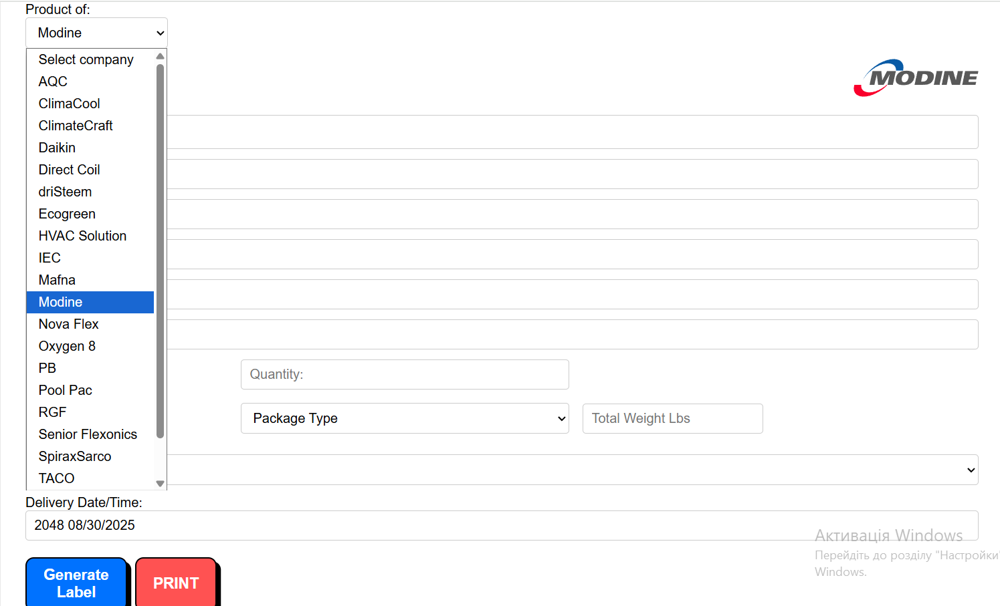

# 📦 Label Maker

A simple web application for generating shipping labels.  
Developed as an internal tool for **Kehoe Equipment** and related manufacturers (Taco, Modine, SpiraxSarco, DriSteem, etc.).  

---

## ✨ Features
- Select a company from the dropdown list (the logo is automatically loaded).  

- Automatic placement of the Kehoe logo on the left and the manufacturer’s logo on the right.  
- Choose the packaging type (Skid, Box, Skids and Boxes, etc.) with corresponding icons.  
- Dynamic addition of **Dimensions** fields depending on the number of **Total Pieces**.  
- Buttons:  
  - **Generate Label** — creates a preview of the label.  
  - **Print** — opens the standard print dialog (printer-friendly layout).  

---

## 🛠 Technologies
- **HTML5** – markup.  
- **CSS3** – styling, responsive design.  
- **JavaScript (Vanilla JS)** – generation logic and dynamic elements.  

---

## 🚀 How to Run
1. Clone the repository:
   ```bash
   git clone https://github.com/your-username/lablemaker.git


                                        Українською

# 📦 Label Maker

Простий веб-додаток для генерації етикеток (лейблів) для відвантаження продукції.  
Розроблений як внутрішній інструмент для **Kehoe Equipment** та суміжних виробників (Taco, Modine, SpiraxSarco, DriSteem тощо).  

---

## ✨ Функціонал
- Вибір компанії з випадаючого списку (автоматично підтягується логотип).  
- Автоматичне додавання логотипу Kehoe ліворуч та логотипу виробника праворуч.  
- Вибір типу упаковки (Skid, Box, Skids and Boxes тощо) з відповідними іконками.  
- Динамічне додавання полів **Dimensions** в залежності від кількості **Total Pieces**.  
- Кнопки:  
  - **Generate Label** — створює попередній перегляд етикетки.  
  - **Print** — відкриває стандартне вікно друку (адаптоване під принтер).  

---

## 🛠 Технології
- **HTML5** – розмітка.  
- **CSS3** – стилізація, адаптивний дизайн.  
- **JavaScript (Vanilla JS)** – логіка генерації та динамічні елементи.  

---

## 🚀 Як запустити
1. Склонуй репозиторій:
   ```bash
   git clone https://github.com/твій-нікнейм/lablemaker.git
# lablemaker