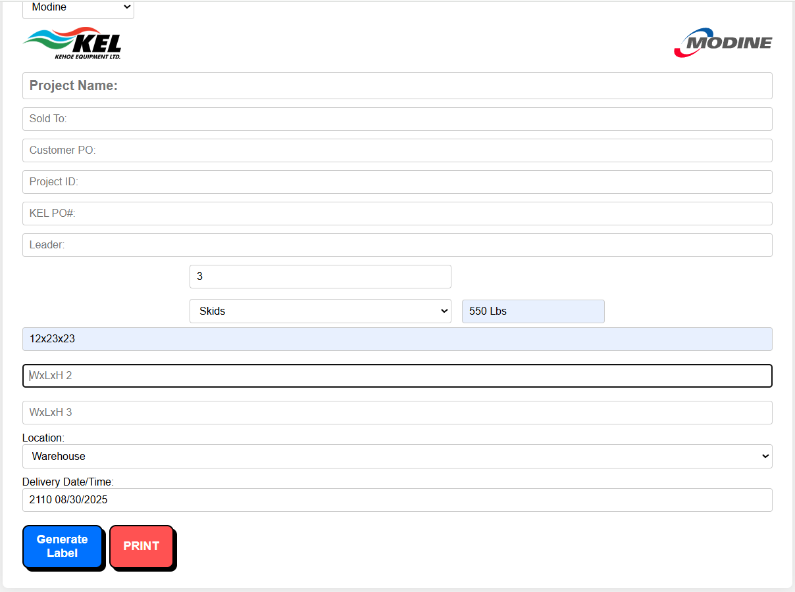

[English](README.md) | [Українською](README.uk.md)

# 📦 Label Maker

A simple web application for generating shipping labels.  
Developed as an internal tool for **Kehoe Equipment** and related manufacturers (Taco, Modine, SpiraxSarco, DriSteem, etc.).  

---

## ✨ Features
- Select a company from the dropdown list (the logo is automatically loaded).  
  

- Automatic placement of the Kehoe logo on the left and the manufacturer’s logo on the right.  

- Choose the packaging type (Skid, Box, Skids and Boxes, etc.) with corresponding icons.  
    

- Dynamic addition of **Dimensions** fields depending on the number of **Total Pieces**.  
    

- Buttons:  
  - **Generate Label** — creates a preview of the label.  
  - **Print** — opens the standard print dialog (printer-friendly layout).  

---

## 🛠 Technologies
- **HTML5** – markup  
- **CSS3** – styling, responsive design  
- **JavaScript (Vanilla JS)** – generation logic and dynamic elements  

---

## 🚀 How to Run
1. Clone the repository:
   ```bash
   git clone https://github.com/your-username/lablemaker.git
