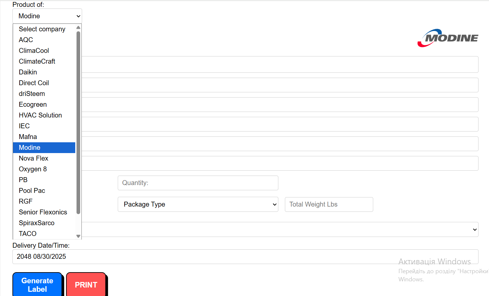
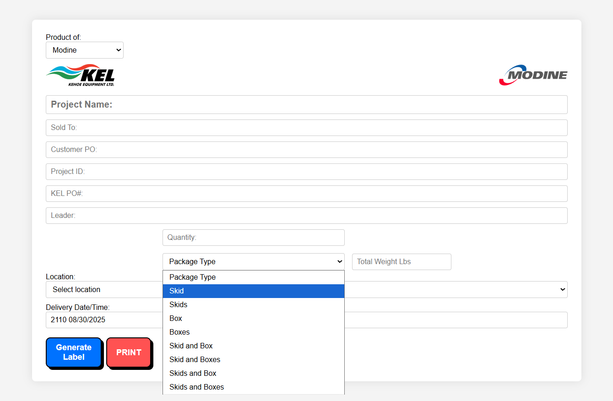
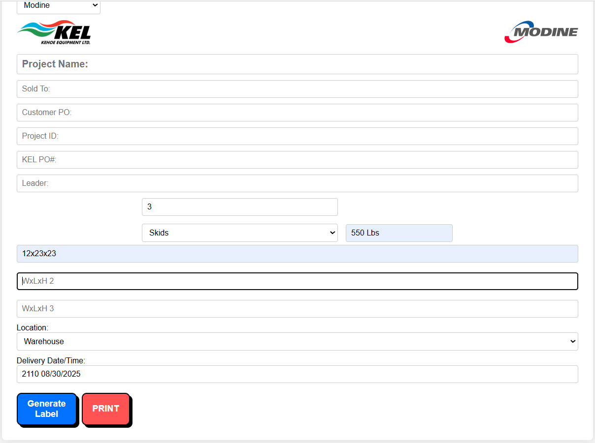

# 📦 Label Maker

Простий веб-додаток для генерації етикеток (лейблів) для відвантаження продукції.  
Розроблений як внутрішній інструмент для **Kehoe Equipment** та суміжних виробників (Taco, Modine, SpiraxSarco, DriSteem тощо).  

---

## ✨ Функціонал
- Вибір компанії з випадаючого списку (автоматично підтягується логотип). 
    

- Автоматичне додавання логотипу Kehoe ліворуч та логотипу виробника праворуч.  

- Вибір типу упаковки (Skid, Box, Skids and Boxes тощо) з відповідними іконками.  
    

- Динамічне додавання полів **Dimensions** в залежності від кількості **Total Pieces**.  
    

- Кнопки:  
  - **Generate Label** — створює попередній перегляд етикетки.  
  - **Print** — відкриває стандартне вікно друку (адаптоване під принтер).  

---

## 🛠 Технології
- **HTML5** – розмітка.  
- **CSS3** – стилізація, адаптивний дизайн.  
- **JavaScript (Vanilla JS)** – логіка генерації та динамічні елементи.  

---

## 🚀 Як запустити
1. Склонуй репозиторій:
   ```bash
   git clone https://github.com/твій-нікнейм/lablemaker.git
# lablemaker